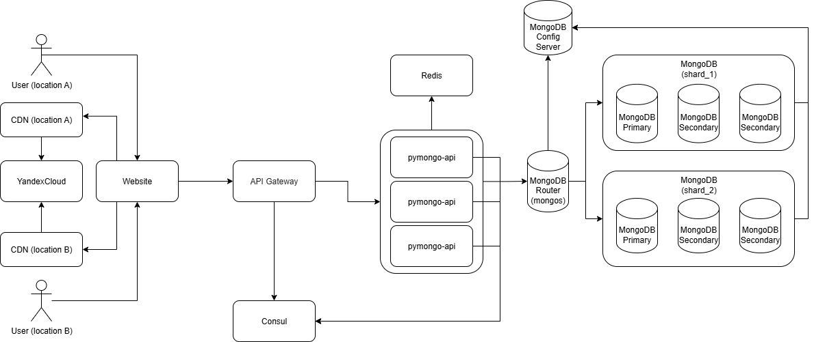
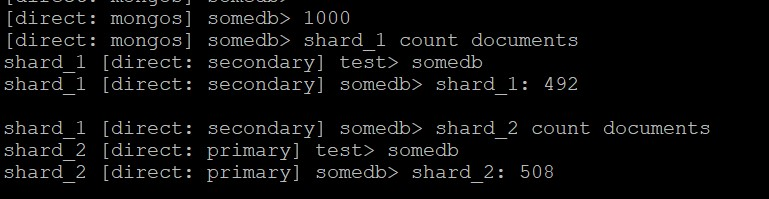
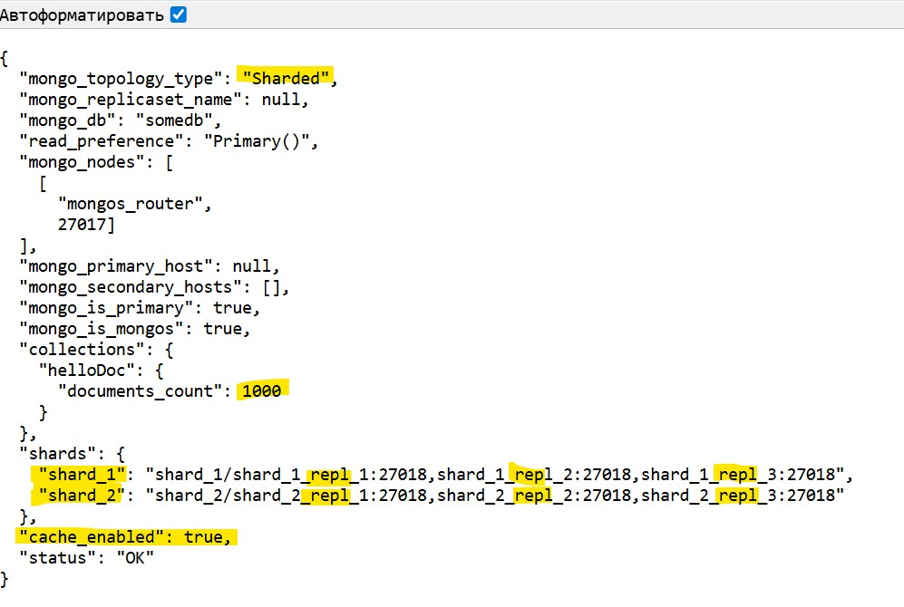
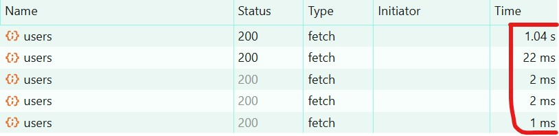

# pymongo-api

## Diagram

[drawio diagram](diagrams/diagram.drawio)




## Как запустить

Запускаем итоговую версию mongodb и приложение

```shell
cd sharding-repl-cache
```

```shell
docker compose up -d
```

Заполняем mongodb данными

```shell
./scripts/mongo-init.sh
```



## Как проверить

### Если вы запускаете проект на локальной машине

Откройте в браузере http://localhost:8080

### Если вы запускаете проект на предоставленной виртуальной машине

Узнать белый ip виртуальной машины

```shell
curl --silent http://ifconfig.me
```

Откройте в браузере http://<ip виртуальной машины>:8080



## Доступные эндпоинты

Список доступных эндпоинтов, swagger http://<ip виртуальной машины>:8080/docs

Второй и последующие вызовы эндпоинта /<collection_name>/users выполняются <1000мс


